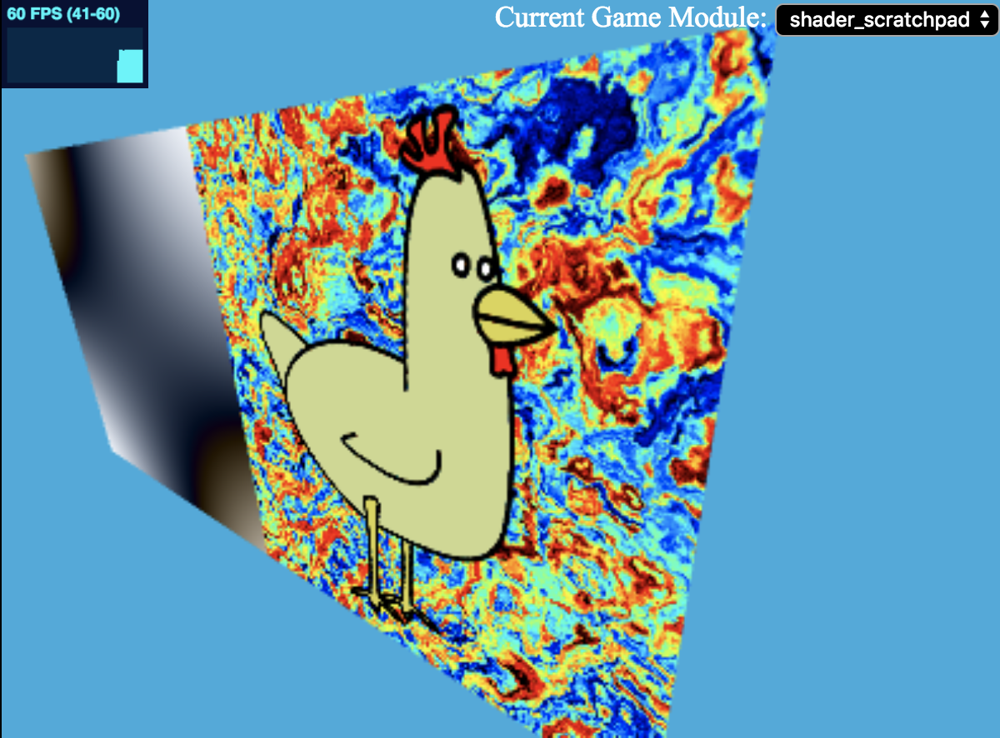
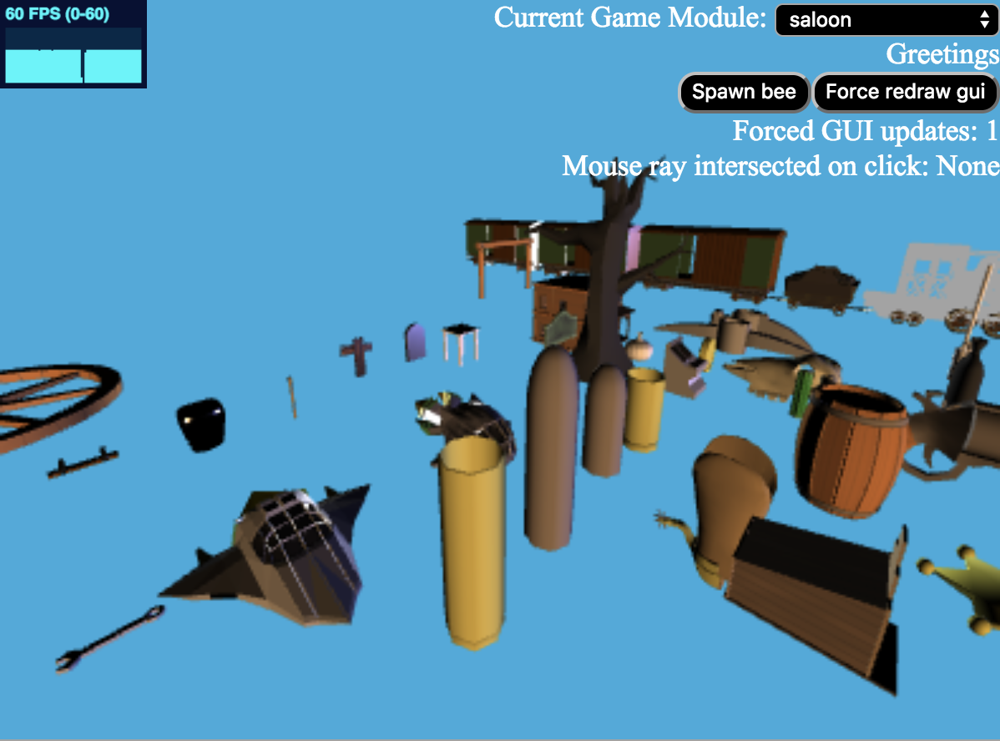
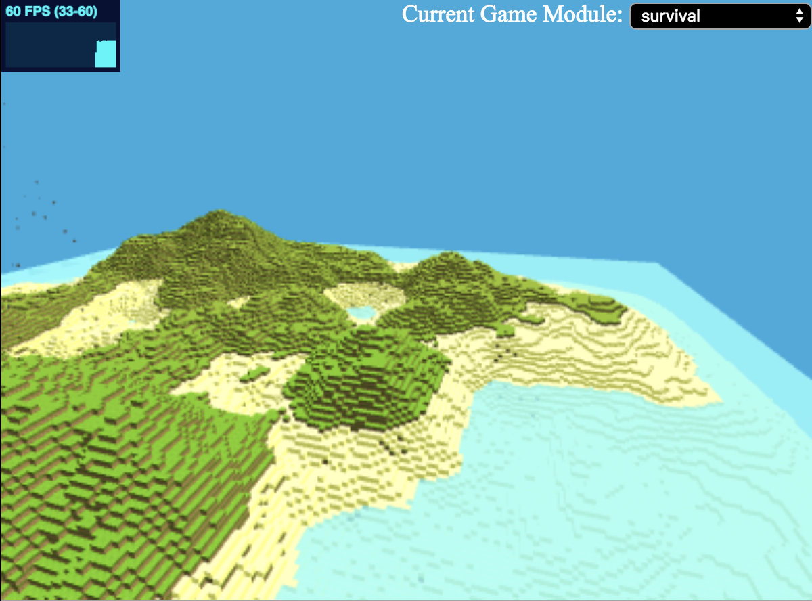
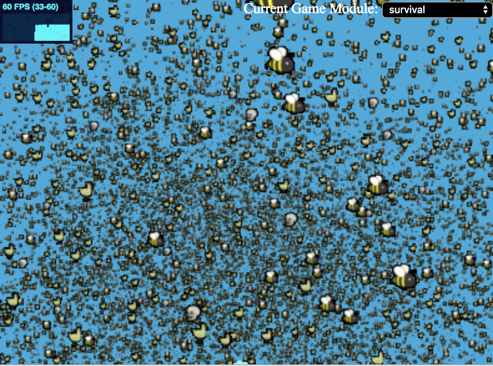

# Threeelectron

A template for 3D desktop applications using Electron. 

<!--  -->

The core dependencies included are Three.js and React.

A few additional libraries such as Tone.JS are included for demo purposes.  

## Requirements (tested with)

### - Ubuntu 16.04, Windows 10 or MacOS High Sierra

### - Electron 2.0.0
    https://github.com/electron/electron/releases/download/v2.0.0/electron-v2.0.0-linux-x64.zip

    https://github.com/electron/electron/releases/download/v2.0.0/electron-v2.0.0-win32-x64.zip
    
    https://github.com/electron/electron/releases/download/v2.0.0/electron-v2.0.0-mas-x64.zip

    https://github.com/electron/electron/releases/download/v2.0.0/electron-v2.0.0-darwin-x64.zip

## To run

Add Electron to your PATH

CD into this directory

    electron .

## Recommended

    Visual Studio Code: https://code.visualstudio.com/

    This extension: https://marketplace.visualstudio.com/items?itemName=slevesque.vscode-3dviewer

<!-- 

 -->

## Screenshots

